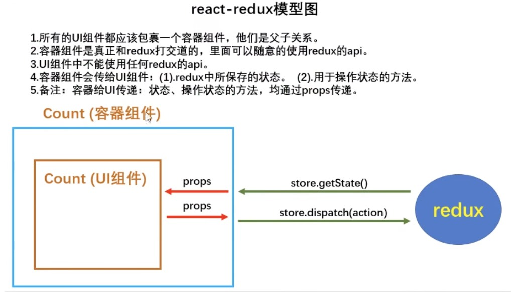

# 1. 求和案例_redux精简版
    （1）去除 Count 组件自身的状态
    （2）src 建立
        -redux
            -store.js
            -count_reducer.js
    （3）store.js
        1）引入 redux 中的 createStore 函数，创建一个 store
        2）createrStore 调用时要穿入一个为其服务的 reduder
        3）记得暴露 store 对象
    （4）count_reducer.js
        1）reducer 的本质是一个函数，接收：preState、action，返回加工后的状态
        2）reducer 有两个作用：初始化状态、加工状态
        3）reducer 被第一次调用时，是 store 自动触发的，
            传递的 preState 是 undefined
            传递的 action 是：{ type: '@@REDUX/INIT_a.2.b.4' }
    （5）在 index.js 中监测 store 中状态的改变，一旦发生改变重新渲染 <APP />
    备注：redux 只负责管理状态，至于状态的改变驱动着页面的展示，要靠我们自己写。   

# 2. 求和案例_redux完整版
    新增文件：
        1. count_action_creator.js 专门用于创建 action 对象
        2. constant.js 放置action中的type

# 3. 求和案例_redux 异步 action 版
    （1）明确：延迟的动作不想交给组件自身，而是交给 action
    （2）何时需要异步 action：想要对状态进行操作，但是具体的数据靠异步返回（非必需）
    （3）具体编码：
        1）npm install redux-thunk，并配置在 store 中
        2）创建 action 的函数不再返回一般对象，而是一个函数，该函数中写异步任务。
        3）异步任务有结果后，分发同步的 action 去真正操作数据。
    （4）备注：异步 action 不是必须要写的，完全可以自己等待异步任务的结果了再去分发同步 action。

# 4. 求和案例_react_redux 的基本使用
    （1）明确两个概念
        1）UI 组件：不能使用任何 redux 的 api，只负责页面的呈现、交互等。
        2）容器组件：负责和 redux 通信，将结果交给 UI 组件
    （2）如何创建一个容器组件——使用 react-redux 的 connect 函数
        connect(mapStateToProps, mapDispatchToProps)(UI组件)
            - mapStateToProps：映射状态，返回值是一个对戏那个
            - mapDispatchToProps：映射操作状态的方法，返回值是一个对象
    （3）备注：容器组件中的 store 是靠 props 传进去的，而不是在容器组件中直接引入。

# 5. 求和案例_react-redux代码优化
    （1）容器组件和 UI 组件整合成一个文件
    （2）无需自己给容器组件传递 store，给 <APP /> 包裹一个 <Provider store={store}> 即可。
    （3）使用了 react-redux 后也不用再自己检测 redux 中状态的改变了，容器组件可以自动完成这个动作。
    （4）mapDispatchToProps 也可以简单的写成一个对象
    （5）一个组件要和 redux 打交道要经过哪几步？
        1）定义好 UI 组件——不暴露
        2）引入 connect 生成一个容器组件，并暴露，写法如下：
            connect(
                state => ({key: value}), // 映射状态
                {key: xxxxxxAction} // 映射操作状态的方法
            )(UI组件)
        3）在 UI 组件中通过 this.props.xxxxx 读取和操作状态